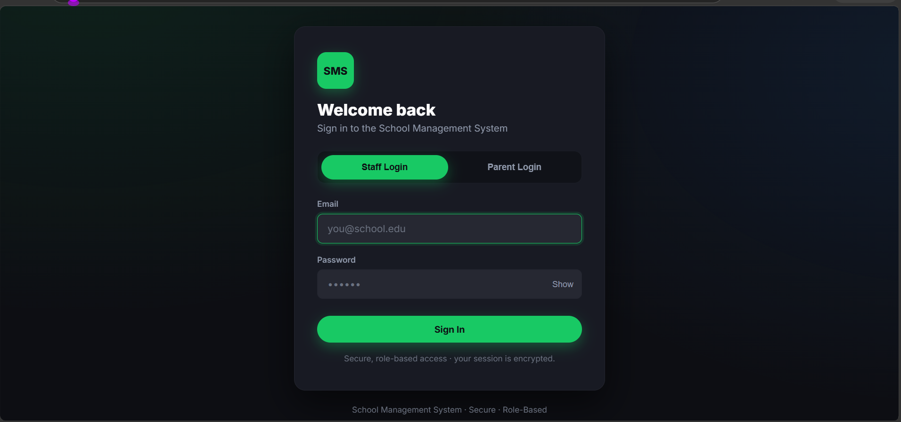
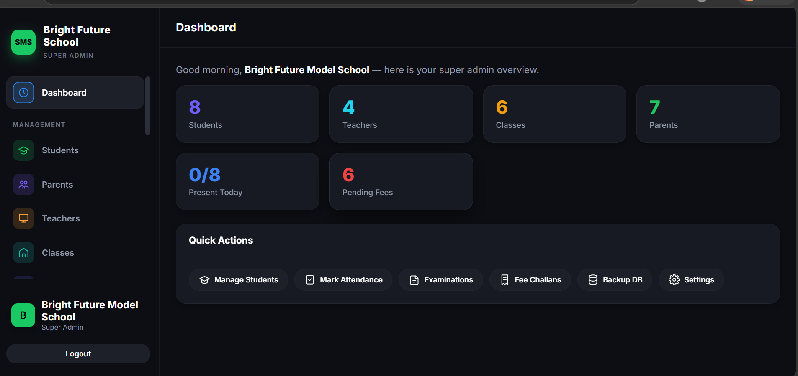
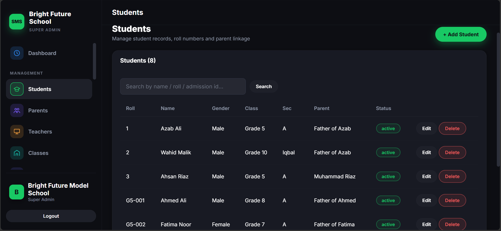
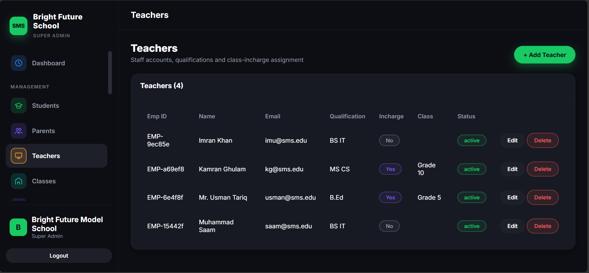
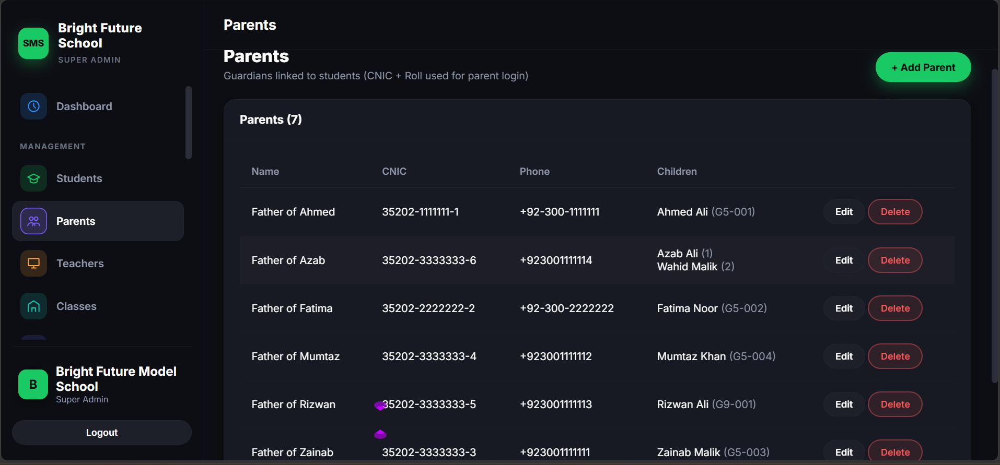
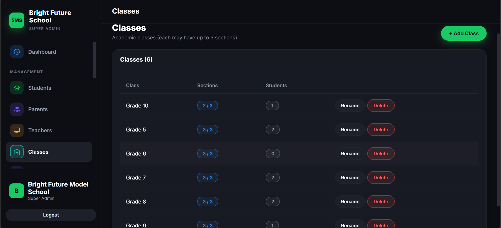
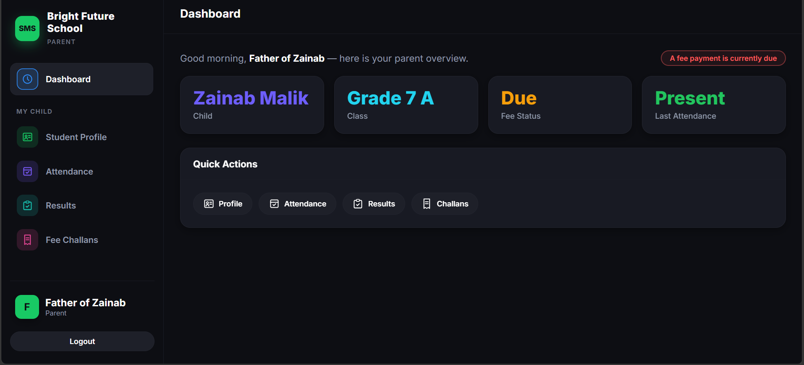

uvicorn app.main:app --reload --port 8000


# 🎓 School Management System

<p align="center">


</p>

A modern **School Management System** developed using **FastAPI**, **SQLite**, **HTML**, **CSS**, and **JavaScript**.

The system is designed to simplify school administration by providing secure role-based access, attendance management, examination management, fee management, reporting, audit logging, and a dedicated Parent Portal.

---

# ✨ Features

## 🔐 Role-Based Authentication

Supports multiple user roles with different permissions.

- Super Admin
- Teacher
- Class Incharge
- Headmaster *(Planned)*

---

## 📊 Dashboard

A centralized dashboard providing an overview of:

- Students
- Teachers
- Parents
- Classes
- Sections
- Pending Fees
- Fee Challans
- School Statistics

---

## 👨‍🎓 Student Management

Complete CRUD operations for students.

- Add Students
- Update Students
- Delete Students
- Search Students

---

## 👨‍🏫 Teacher Management

Manage teachers with full CRUD support.

- Teacher Profiles
- Teacher Assignment
- Password Management

---

## 👨‍👩‍👧 Parent Management

Manage parent accounts and connect parents with students.

---

## 🏫 Class & Section Management

- Create Classes
- Create Sections
- Assign Class Incharge

---

## 📚 Subject Management

- Create Subjects
- Assign Subjects
- Manage Curriculum

---

## 👨‍🏫 Teacher Assignment

Assign teachers to:

- Classes
- Sections
- Subjects

---

# ✅ Attendance System

## Student Attendance

Attendance can be marked by:

- Super Admin
- Assigned Class Incharge

Once attendance is submitted by the Class Incharge, it becomes **locked**.

Only the Super Admin can unlock attendance.

Every unlock action requires a valid reason and is permanently recorded in the Audit Log.

---

## Teacher Attendance

Teacher attendance follows the same secure lock/unlock workflow.

(Currently managed by the Super Admin until the Headmaster module is implemented.)

---

# 📝 Examination Management

- Create Exams
- Manage Results
- Store Examination Records

---

# 🎯 Student Promotion

Supports two promotion methods.

### Result Based

Automatically promote students based on examination results.

### Manual

Promote selected students manually whenever required.

---

# 💰 Fee Management

## Fee Structure

Create different fee structures for each class.

---

## Monthly Fee Challans

Generate fee challans for all classes with **one click** every month.

---

# 📄 Reports

Generate professional PDF reports including:

- Student Attendance
- Teacher Attendance
- Fee Challans
- Student Information
- Examination Reports
- Administrative Reports

---

# 🔍 Audit Log

Every important activity inside the system is recorded.

Examples:

- Login Activity
- Record Creation
- Record Updates
- Record Deletion
- Attendance Unlock
- Fee Challan Generation
- Administrative Changes
- Authorized Actions
- Unauthorized Attempts

This provides complete accountability throughout the system.

---

# 💾 Backup

Create complete database backups in **JSON** format for:

- Backup
- Restore
- Migration
- Disaster Recovery

---

# ⚙️ Settings

System administrators can manage:

- School Profile
- Teacher Passwords
- User Accounts
- Account Suspension
- General Configuration

---

# 👨‍👩‍👧 Parent Portal

Parents can securely log in using:

- CNIC Number
- Student Roll Number

Parents can view:

- Student Profile
- Attendance
- Examination Results
- Fee Challans
- Academic Information

---

# 🖼️ Screenshots

## Staff Login



---

## Admin Dashboard



---

## Student Management



---

## Teacher Management



---

## Parent Management



---

## Class Management



---

## Student Attendance


---

## Fee Challans


---

## Reports


---

## Parent Portal



---

# 🗂 Project Structure

```
School-Management-System
│
├── app/
├── static/
├── tests/
├── docs/
├── screenshots/
├── requirements.txt
├── README.md
└── LICENSE
```

---

# 🛠 Technology Stack

Backend

- FastAPI
- Python

Frontend

- HTML
- CSS
- JavaScript

Database

- SQLite

Authentication

- Passlib
- ItsDangerous

Testing

- Pytest
- Playwright

Reporting

- ReportLab

---

# 🧪 Running the Project

```bash
git clone https://github.com/YOUR_USERNAME/School-Management-System.git

cd School-Management-System

python -m venv venv

venv\Scripts\activate

pip install -r requirements.txt

uvicorn app.main:app --reload
```

---

# 📌 Future Improvements

- Headmaster Role
- Email Notifications
- SMS Notifications
- Student ID Cards
- Timetable Management
- Library Management
- Hostel Management
- Online Admissions
- Multi-School Support
- PostgreSQL Support
- Docker Deployment

---

# 📜 License

This project is licensed under the MIT License.

---

# 👨‍💻 Author

**Muhammad Saam**

BS Information Technology

Pakistan

---

⭐ If you like this project, consider giving it a star on GitHub.
